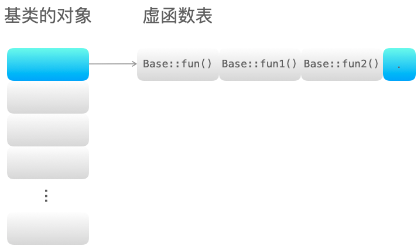
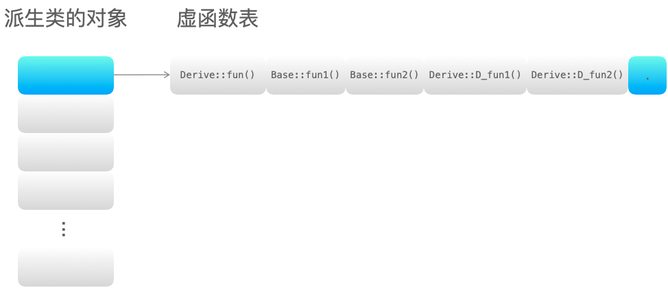

## 什么是面向对象？面向对象的三大特性
> 面向对象：对象是指具体的某一个事物，这些事物的抽象就是类，类中包含数据（成员变量）和动作（成员方法）。
>
> 面向对象的三大特性：
> * 封装：将具体的实现过程和数据封装成一个函数，只能通过接口进行访问，降低耦合性。
> * 继承：子类继承父类的特征和行为，子类有父类的非 private 方法或成员变量，子类可以对父类的方法进行重写，增强了类之间的耦合性，但是当父类中的成员变量、成员函数或者类本身被 final 关键字修饰时，修饰的类不能继承，修饰的成员不能重写或修改。
> * 多态：多态就是不同继承类的对象，对同一消息做出不同的响应，基类的指针指向或绑定到派生类的对象，使得基类指针呈现不同的表现方式。

## 重载、重写、隐藏的区别
> 概念解释：
> * 重载：是指同一可访问区内被声明几个具有不同参数列（参数的类型、个数、顺序）的同名函数，根据参数列表确定调用哪个函数，重载不关心函数返回类型。
>   ```C++
>   class A
>   {
>   public:
>       void fun(int tmp);
>       void fun(float tmp);        // 重载 参数类型不同（相对于上一个函数）
>       void fun(int tmp, float tmp1); // 重载 参数个数不同（相对于上一个函数）
>       void fun(float tmp, int tmp1); // 重载 参数顺序不同（相对于上一个函数）
>       int fun(int tmp);            // error: 'int A::fun(int)' cannot be overloaded 错误：注意重载不关心函数返回类型
>   };
>   ```
> * 隐藏：是指派生类的函数屏蔽了与其同名的基类函数，主要只要同名函数，不管参数列表是否相同，基类函数都会被隐藏。
>    ```C++
>    #include <iostream>
>    using namespace std;
>
>    class Base
>    {
>    public:
>        void fun(int tmp, float tmp1) { cout << "Base::fun(int tmp, float tmp1)" << endl; }
>    };
>
>    class Derive : public Base
>    {
>    public:
>        void fun(int tmp) { cout << "Derive::fun(int tmp)" << endl; } // 隐藏基类中的同名函数
>    };
>
>    int main()
>    {
>        Derive ex;
>        ex.fun(1);       // Derive::fun(int tmp)
>        ex.fun(1, 0.01); // error: candidate expects 1 argument, 2 provided
>        return 0;
>    }
>    ```
>   说明：上述代码中 ex.fun(1, 0.01); 出现错误，说明派生类中将基类的同名函数隐藏了。若是想调用基类中的同名函数，可以加上类型名指明 ex.Base::fun(1, 0.01);，这样就可以调用基类中的同名函数。
> * 重写(覆盖)：是指派生类中存在重新定义的函数。函数名、参数列表、返回值类型都必须同基类中被重写的函数一致，只有函数体不同。派生类调用时会调用派生类的重写函数，不会调用被重写函数。重写的基类中被重写的函数必须有 ***virtual*** 修饰。
>    ```C++
>    #include <iostream>
>    using namespace std;
>
>    class Base
>    {
>    public:
>        virtual void fun(int tmp) { cout << "Base::fun(int tmp) : " << tmp << endl; }
>    };
>
>    class Derived : public Base
>    {
>    public:
>        virtual void fun(int tmp) { cout << "Derived::fun(int tmp) : " << tmp << endl; } // 重写基类中的 fun 函数
>    };
>    int main()
>    {
>        Base *p = new Derived();
>        p->fun(3); // Derived::fun(int) : 3
>        return 0;
>    }
>    ```
> 
> **重写和重载的区别：**
> * 范围区别：对于类中函数的重载或者重写而言，重载发生在同一个类的内部，重写发生在不同的类之间（子类和父类之间）。
> * 参数区别：重载的函数需要与原函数有相同的函数名、不同的参数列表，不关注函数的返回值类型；重写的函数的函数名、参数列表和返回值类型都需要和原函数相同，父类中被重写的函数需要有 virtual 修饰。
> * virtual 关键字：重写的函数基类中必须有 virtual关键字的修饰，重载的函数可以有 virtual 关键字的修饰也可以没有。
>
> **隐藏和重写，重载的区别：**
> * 范围区别：隐藏与重载范围不同，隐藏发生在不同类中。
> * 参数区别：隐藏函数和被隐藏函数参数列表可以相同，也可以不同，但函数名一定相同；当参数不同时，无论基类中的函数是否被 virtual 修饰，基类函数都是被隐藏，而不是重写。

## 如何理解 C++ 是面向对象编程
> 说明：该问题最好结合自己的项目经历进行展开解释，或举一些恰当的例子，同时对比下面向过程编程。
> * **面向过程编程**：一种以执行程序操作的过程或函数为中心编写软件的方法。程序的数据通常存储在变量中，与这些过程是分开的。所以必须将变量传递给需要使用它们的函数。缺点：随着程序变得越来越复杂，程序数据与运行代码的分离可能会导致问题。例如，程序的规范经常会发生变化，从而需要更改数据的格式或数据结构的设计。当数据结构发生变化时，对数据进行操作的代码也必须更改为接受新的格式。查找需要更改的所有代码会为程序员带来额外的工作，并增加了使代码出现错误的机会。
> * **面向对象编程**（Object-Oriented Programming, OOP）：以创建和使用对象为中心。一个对象（Object）就是一个软件实体，它将数据和程序在一个单元中组合起来。对象的数据项，也称为其属性，存储在成员变量中。对象执行的过程被称为其成员函数。将对象的数据和过程绑定在一起则被称为封装。
>
> **面向对象编程进一步说明：**
> 面向对象编程将数据成员和成员函数封装到一个类中，并声明数据成员和成员函数的访问级别（public、private、protected），以便控制类对象对数据成员和函数的访问，对数据成员起到一定的保护作用。而且在类的对象调用成员函数时，只需知道成员函数的名、参数列表以及返回值类型即可，无需了解其函数的实现原理。当类内部的数据成员或者成员函数发生改变时，不影响类外部的代码。

## 什么是多态？多态如何实现？
> **多态**：多态就是不同继承类的对象，对同一消息做出不同的响应，基类的指针指向或绑定到派生类的对象，使得基类指针呈现不同的表现方式。在基类的函数前加上 virtual 关键字，在派生类中重写该函数，运行时将会根据对象的实际类型来调用相应的函数。如果对象类型是派生类，就调用派生类的函数；如果对象类型是基类，就调用基类的函数。<br>
> **实现方法**：多态是通过虚函数实现的，虚函数的地址保存在虚函数表中，虚函数表的地址保存在含有虚函数的类的实例对象的内存空间中。
>
> **实现过程：**
> 1. 在类中用 virtual 关键字声明的函数叫做虚函数；
> 2. 存在虚函数的类都有一个虚函数表，当创建一个该类的对象时，该对象有一个指向虚函数表的虚表指针（虚函数表和类对应的，虚表指针是和对象对应）；
> 3. 当基类指针指向派生类对象，基类指针调用虚函数时，基类指针指向派生类的虚表指针，由于该虚表指针指向派生类虚函数表，通过遍历虚表，寻找相应的虚函数。
>
> 举例：
>    ```C++
>    #include <iostream>
>    using namespace std;
>
>    class Base
>    {
>    public:
>        virtual void fun() { cout << "Base::fun()" << endl; }
>
>        virtual void fun1() { cout << "Base::fun1()" << endl; }
>
>        virtual void fun2() { cout << "Base::fun2()" << endl; }
>    };
>    class Derive : public Base
>    {
>    public:
>        void fun() { cout << "Derive::fun()" << endl; }
>
>        virtual void D_fun1() { cout << "Derive::D_fun1()" << endl; }
>
>        virtual void D_fun2() { cout << "Derive::D_fun2()" << endl; }
>    };
>    int main()
>    {
>        Base *p = new Derive();
>        p->fun(); // Derive::fun() 调用派生类中的虚函数
>        return 0;
>    }
>    ```
> 基类的虚函数表如下：
> 
> 派生类的对象虚函数表如下：
> 
> 简单解释：当基类的指针指向派生类的对象时，通过派生类的对象的虚表指针找到虚函数表派生类的对象虚函数表），进而找到相应的虚函数 Derive::f() 进行调用。
