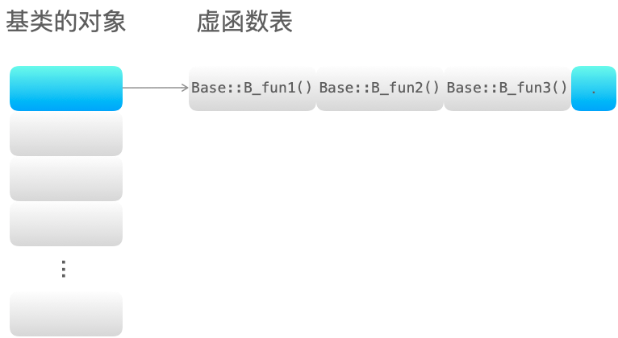

# 类相关
第五章主要讲解类相关的知识点，涉及到虚函数、继承、构造函数、析构函数、深拷贝、浅拷贝等知识点，本章的内容十分重要，同时也是面试过程中的高频问题。
<div id="head"></div><br>

# 目录
[什么是虚函数？什么是纯虚函数？](#virtual_pure_virtual)<br>
[虚函数和纯虚函数的区别？](#diff_virtual_pure_virtual)<br>
[虚函数的实现机制](#virtual_mech)<br>
[单继承和多继承的虚函数表结构](#inheritance)<br>
[如何禁止构造函数的使用？](#prohibit_constructor)<br>
[什么是类的默认构造函数？](#default_constructor)<br>
[构造函数、析构函数是否需要定义成虚函数？为什么？](#cons_des_virtual)<br>
[如何避免拷贝？](#avoid_cpy)<br>
[如何减少构造函数开销？](#reduce_constructor)<br>
[多重继承时会出现什么状况？如何解决？](#multiple_inheritance)<br>
[空类占多少字节？C++ 编译器会给一个空类自动生成哪些函数？](#empty_class)<br>
[为什么拷贝构造函数必须为引用？](#cpy_cons_ref)<br>
[C++ 类对象的初始化顺序](#init_order)<br>
[如何禁止一个类被实例化？](#prohibit_instantiate)<br>
[为什么用成员初始化列表会快一些？](#faster_initialize_with_members)<br>
[实例化一个对象需要哪几个阶段](#stage_of_instantiate_object)<br>
[友元函数的作用及使用场景](#friend)<br>
[静态绑定和动态绑定是怎么实现的？](#static_dynamic_binding)<br>
[深拷贝和浅拷贝的区别](#diff_deep_shallow_copy)<br>
[编译时多态和运行时多态的区别](#compile_time_run_time_polymorphism)<br>
[实现一个类成员函数，要求不允许修改类的成员变量？](#member_func)<br>
[如何让类不能被继承？](#final)<br>

<div id="virtual_pure_virtual"></div><br>

## 什么是虚函数？什么是纯虚函数？
**虚函数：** 被 virtual 关键字修饰的成员函数，就是虚函数。
```C++
#include <iostream>
using namespace std;

class A
{
public:
    virtual void v_fun() // 虚函数
    {
        cout << "A::v_fun()" << endl;
    }
};
class B : public A
{
public:
    void v_fun()
    {
        cout << "B::v_fun()" << endl;
    }
};
int main()
{
    A *p = new B();
    p->v_fun(); // B::v_fun()
    return 0;
}
```
**纯虚函数：**
* 纯虚函数在类中声明时，加上 =0；
* 含有纯虚函数的类称为抽象类（只要含有纯虚函数这个类就是抽象类），类中只有接口，没有具体的实现方法；
* 继承纯虚函数的派生类，如果没有完全实现基类纯虚函数，依然是抽象类，不能实例化对象。

说明：<br>
* 抽象类对象不能作为函数的参数，不能创建对象，不能作为函数返回类型；
* 可以声明抽象类指针，可以声明抽象类的引用；
* 子类必须继承父类的纯虚函数，并全部实现后，才能创建子类的对象。

[回到目录](#head)<br>

<div id="diff_virtual_pure_virtual"></div><br>

## 虚函数和纯虚函数的区别？
* 虚函数和纯虚函数可以出现在同一个类中，该类称为抽象基类。（含有纯虚函数的类称为抽象基类）
* 使用方式不同：虚函数可以直接使用，纯虚函数必须在派生类中实现后才能使用；
* 定义形式不同：虚函数在定义时在普通函数的基础上加上 virtual 关键字，纯虚函数定义时除了加上virtual 关键字还需要加上 =0;
* 虚函数必须实现，否则编译器会报错；
* 对于实现纯虚函数的派生类，该纯虚函数在派生类中被称为虚函数，虚函数和纯虚函数都可以在派生类中重写；
* 析构函数最好定义为虚函数，特别是对于含有继承关系的类；析构函数可以定义为纯虚函数，此时，其所在的类为抽象基类，不能创建实例化对象。

[回到目录](#head)<br>

<div id="virtual_mech"></div><br>

## 虚函数的实现机制
**实现机制：** 虚函数通过虚函数表来实现。虚函数的地址保存在虚函数表中，在类的对象所在的内存空间中，保存了指向虚函数表的指针（称为“虚表指针”），通过虚表指针可以找到类对应的虚函数表。虚函数表解决了基类和派生类的继承问题和类中成员函数的覆盖问题，当用基类的指针来操作一个派生类的时候，这张虚函数表就指明了实际应该调用的函数。

**虚函数表相关知识点：**
* 虚函数表存放的内容：类的虚函数的地址。
* 虚函数表建立的时间：编译阶段，即程序的编译过程中会将虚函数的地址放在虚函数表中。
* 虚表指针保存的位置：虚表指针存放在对象的内存空间中最前面的位置，这是为了保证正确取到虚函数的偏移量。<br>

注：虚函数表和类绑定，虚表指针和对象绑定。即类的不同的对象的虚函数表是一样的，但是每个对象都有自己的虚表指针，来指向类的虚函数表。

**实例：**

无虚函数覆盖的情况：
```C++
#include <iostream>
using namespace std;

class Base
{
public:
    virtual void B_fun1() { cout << "Base::B_fun1()" << endl; }
    virtual void B_fun2() { cout << "Base::B_fun2()" << endl; }
    virtual void B_fun3() { cout << "Base::B_fun3()" << endl; }
};

class Derive : public Base
{
public:
    virtual void D_fun1() { cout << "Derive::D_fun1()" << endl; }
    virtual void D_fun2() { cout << "Derive::D_fun2()" << endl; }
    virtual void D_fun3() { cout << "Derive::D_fun3()" << endl; }
};
int main()
{
    Base *p = new Derive();
    p->B_fun1(); // Base::B_fun1()
    return 0;
}
```
基类和派生类的继承关系：

基类的虚函数表：

派生类的虚函数表：

主函数中基类的指针 p 指向了派生类的对象，当调用函数 B_fun1() 时，通过派生类的虚函数表找到该函数的地址，从而完成调用。
[回到目录](#head)<br>

<div id="inheritance"></div><br>

## 单继承和多继承的虚函数表结构

[回到目录](#head)<br>

<div id="prohibit_constructor"></div><br>

## 如何禁止构造函数的使用？


[回到目录](#head)<br>

<div id="default_constructor"></div><br>

## 什么是类的默认构造函数？


[回到目录](#head)<br>

<div id="cons_des_virtual"></div><br>

## 构造函数、析构函数是否需要定义成虚函数？为什么？

[回到目录](#head)<br>

<div id="avoid_cpy"></div><br>

## 如何避免拷贝？

[回到目录](#head)<br>

<div id="reduce_constructor"></div><br>

## 如何减少构造函数开销？

[回到目录](#head)<br>

<div id="multiple_inheritance"></div><br>

## 多重继承时会出现什么状况？如何解决？

[回到目录](#head)<br>

<div id="empty_class"></div><br>

## 空类占多少字节？C++ 编译器会给一个空类自动生成哪些函数？

[回到目录](#head)<br>

<div id="cpy_cons_ref"></div><br>

## 为什么拷贝构造函数必须为引用？

[回到目录](#head)<br>

<div id="init_order"></div><br>

## C++ 类对象的初始化顺序

[回到目录](#head)<br>

<div id="prohibit_instantiate"></div><br>

## 如何禁止一个类被实例化？

[回到目录](#head)<br>

<div id="faster_initialize_with_members"></div><br>

## 为什么用成员初始化列表会快一些？

[回到目录](#head)<br>

<div id="stage_of_instantiate_object"></div><br>

## 实例化一个对象需要哪几个阶段

[回到目录](#head)<br>

<div id="friend"></div><br>

## 友元函数的作用及使用场景

[回到目录](#head)<br>

<div id="static_dynamic_binding"></div><br>

## 静态绑定和动态绑定是怎么实现的？

[回到目录](#head)<br>

<div id="diff_deep_shallow_copy"></div><br>

## 深拷贝和浅拷贝的区别

[回到目录](#head)<br>

<div id="compile_time_run_time_polymorphism"></div><br>

## 编译时多态和运行时多态的区别

[回到目录](#head)<br>

<div id="member_func"></div><br>

## 实现一个类成员函数，要求不允许修改类的成员变量？

[回到目录](#head)<br>

<div id="final"></div><br>

## 如何让类不能被继承？

[回到目录](#head)<br>