# 自建机场保姆级教程

## 1. 选择服务器运营商
这里我们选用[vultr](https://www.vultr.com "vultr"), 网址为<https://www.vultr.com><br>
在注册vultr之前需要注册一个邮箱，这里我们注册了一个QQ邮箱：
> QQ昵称：airport<br>
QQ账号：212307840<br>
QQ密码：airport123<br>
QQ手机：18328717615<br>
QQ邮箱：airport_share@qq.com<br>

注册vultr账号：
> 账号：airport_share@qq.com<br>
密码：Jizhumima123


## 2. 充值
> 这里可以直接使用支付宝支付，支付成功后直接在群里发起群收款
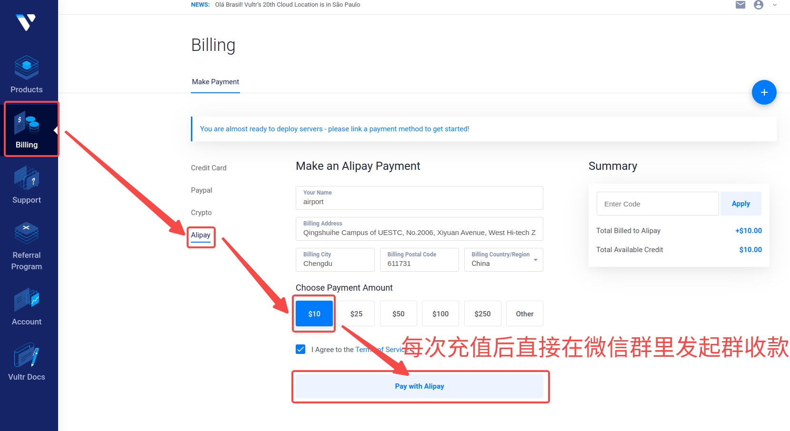


## 3. 开启服务器
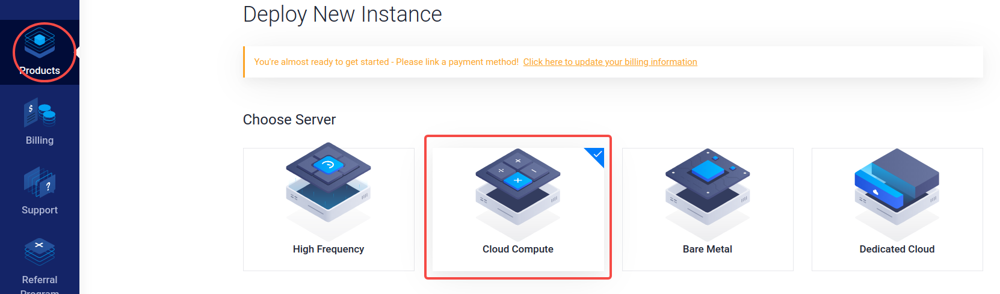
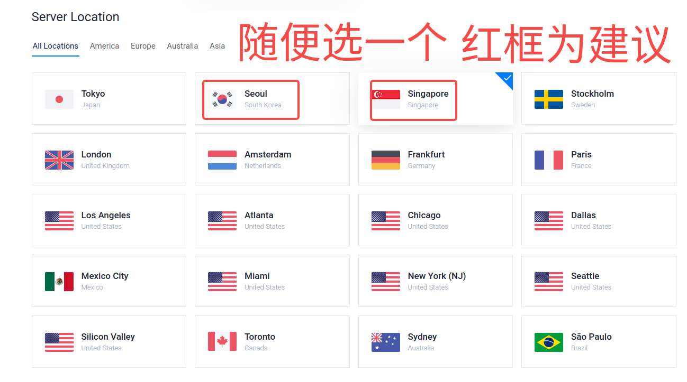
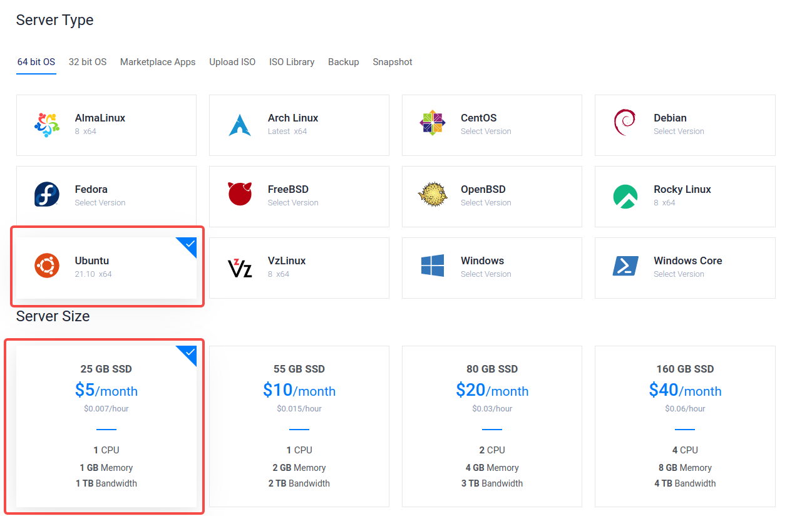
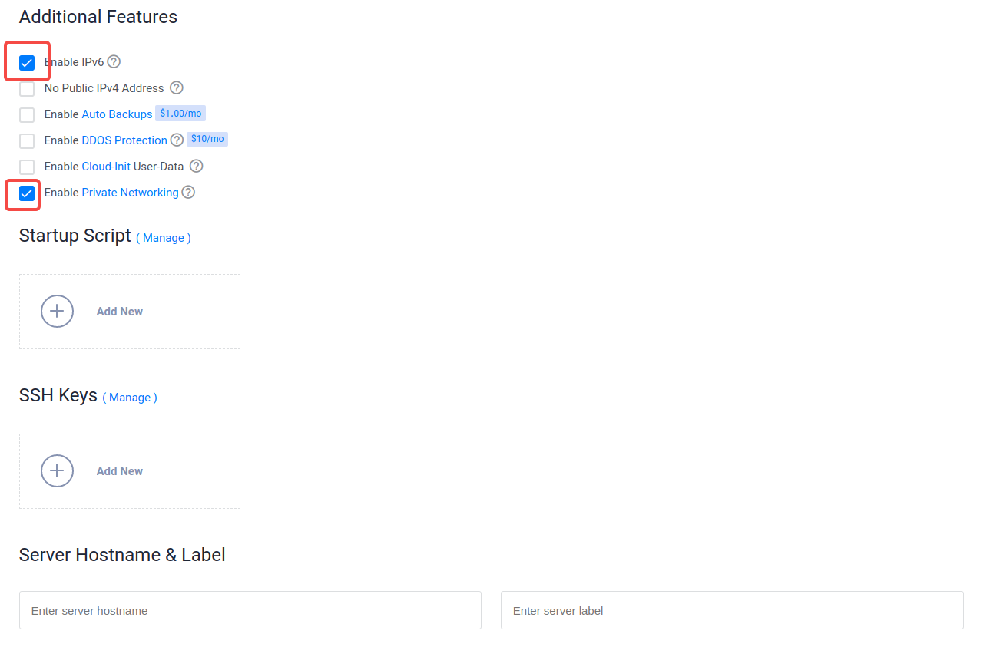
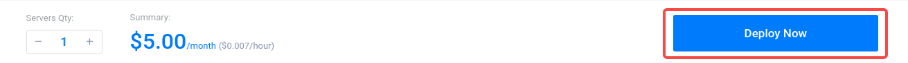
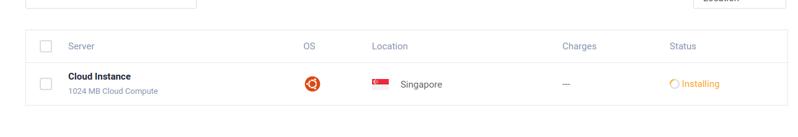

## 4. 部署服务
点击服务器查看服务器信息：<br>
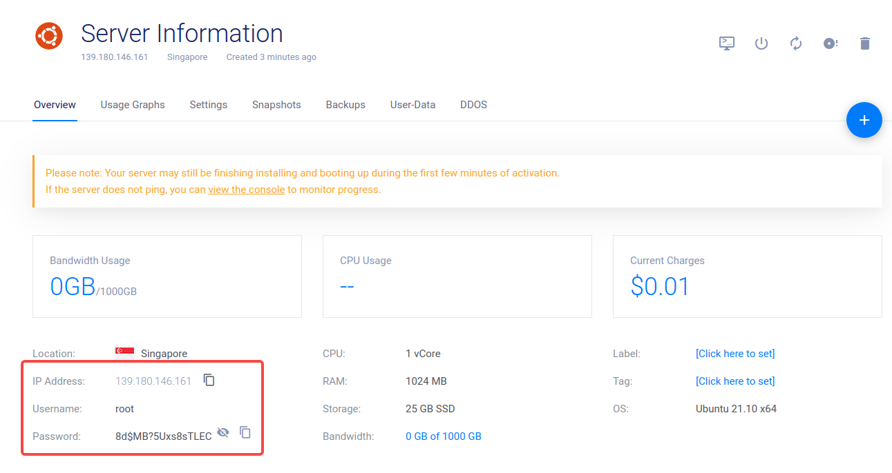

等待服务器开启成功就可以连接服务器进行服务部署了，连接的方法因设备各异，这里介绍几种连接服务器方法。<br>

**浏览器直接连接：**
> 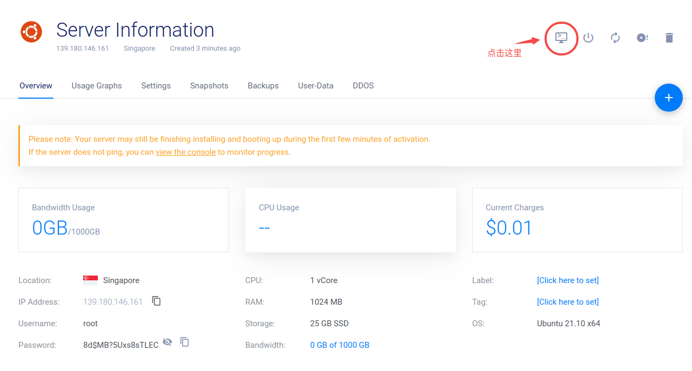

**安卓手机or苹果手机：**
> 可以下载JuiceSSH软件连接

**Windows:**
> Windows可以使用CMD或者powershell或者putty连接服务器<br>
> 参考链接： <https://www.cnblogs.com/hanguozhi/p/8892952.html>

**Linux 或者 MAC：**
> 用系统自带的shell:
> 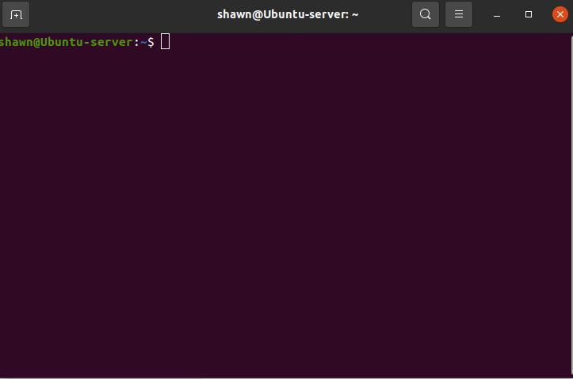

**连接方法:**
> 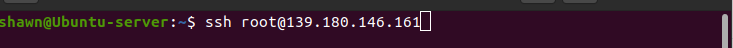
> 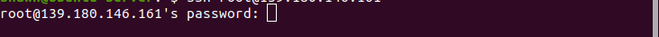
> 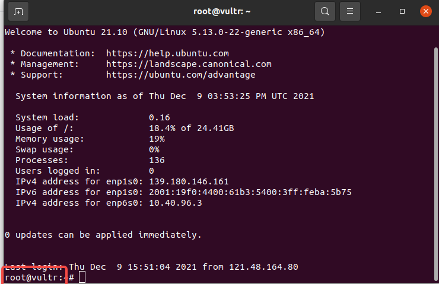<br>

这样我们就连接上了vultr服务器了，接下来就是部署我们的v2ray服务和ssr服务了。

## V2ray
>```bash
>bash <(curl -s -L https://git.io/v2ray-setup.sh)
>```
> 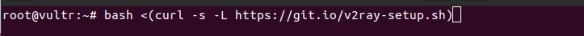<br>
> 等待配置结束就可以使用v2ray了, 配置完毕后将最新的配置信息直接发到群里
> 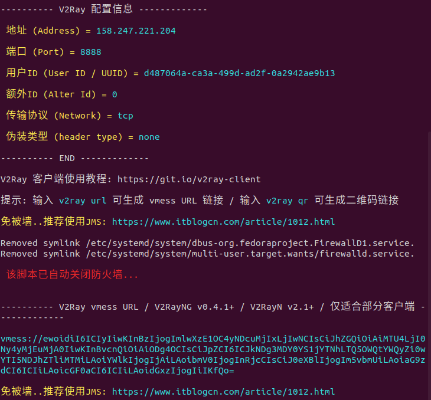<br>
```
---------- V2Ray 配置信息 -------------

---------- V2Ray 配置信息 -------------

 地址 (Address) = 158.247.221.204

 端口 (Port) = 8888

 用户ID (User ID / UUID) = d487064a-ca3a-499d-ad2f-0a2942ae9b13

 额外ID (Alter Id) = 0

 传输协议 (Network) = tcp

 伪装类型 (header type) = none

---------- END -------------

V2Ray 客户端使用教程: https://git.io/v2ray-client

提示: 输入 v2ray url 可生成 vmess URL 链接 / 输入 v2ray qr 可生成二维码链接

免被墙..推荐使用JMS: https://www.itblogcn.com/article/1012.html

Removed symlink /etc/systemd/system/dbus-org.fedoraproject.FirewallD1.service.
Removed symlink /etc/systemd/system/multi-user.target.wants/firewalld.service.

 该脚本已自动关闭防火墙... 


---------- V2Ray vmess URL / V2RayNG v0.4.1+ / V2RayN v2.1+ / 仅适合部分客户端 -------------

vmess://ewoidiI6ICIyIiwKInBzIjogImlwXzE1OC4yNDcuMjIxLjIwNCIsCiJhZGQiOiAiMTU4LjI0Ny4yMjEuMjA0IiwKInBvcnQiOiAiODg4OCIsCiJpZCI6ICJkNDg3MDY0YS1jYTNhLTQ5OWQtYWQyZi0wYTI5NDJhZTliMTMiLAoiYWlkIjogIjAiLAoibmV0IjogInRjcCIsCiJ0eXBlIjogIm5vbmUiLAoiaG9zdCI6ICIiLAoicGF0aCI6ICIiLAoidGxzIjogIiIKfQo=

免被墙..推荐使用JMS: https://www.itblogcn.com/article/1012.html

```

## SSR
>```bash
>wget -N --no-check-certificate https://raw.githubusercontent.com/ToyoDAdoubi/doubi/master/ssr.sh && chmod +x ssr.sh && bash ssr.sh
>```
> 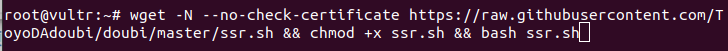<br>
> 等待配置结束就可以使用ssr了(首次配置ssr选择：1.安装ShadowsocksR), 配置完毕后将最新的配置信息直接发到群里
> 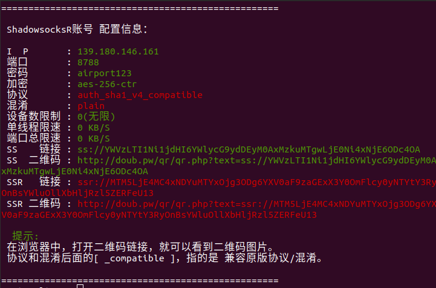<br>
```
===================================================

 ShadowsocksR账号 配置信息：

 I  P	    : 139.180.146.161
 端口	    : 8788
 密码	    : airport123
 加密	    : aes-256-ctr
 协议	    : auth_sha1_v4_compatible
 混淆	    : plain
 设备数限制 : 0(无限)
 单线程限速 : 0 KB/S
 端口总限速 : 0 KB/S
 SS    链接 : ss://YWVzLTI1Ni1jdHI6YWlycG9ydDEyM0AxMzkuMTgwLjE0Ni4xNjE6ODc4OA 
 SS  二维码 : http://doub.pw/qr/qr.php?text=ss://YWVzLTI1Ni1jdHI6YWlycG9ydDEyM0AxMzkuMTgwLjE0Ni4xNjE6ODc4OA
 SSR   链接 : ssr://MTM5LjE4MC4xNDYuMTYxOjg3ODg6YXV0aF9zaGExX3Y0OmFlcy0yNTYtY3RyOnBsYWluOllXbHljRzl5ZERFeU13 
 SSR 二维码 : http://doub.pw/qr/qr.php?text=ssr://MTM5LjE4MC4xNDYuMTYxOjg3ODg6YXV0aF9zaGExX3Y0OmFlcy0yNTYtY3RyOnBsYWluOllXbHljRzl5ZERFeU13 
 
  提示: 
 在浏览器中，打开二维码链接，就可以看到二维码图片。
 协议和混淆后面的[ _compatible ]，指的是 兼容原版协议/混淆。

===================================================
```

# 客户端
v2ray参考链接：<https://www.moonue.com/11/476/><br>
安卓推荐v2rayNG, Linux客户端推荐v2rayA, Windows客户端推荐V2rayN