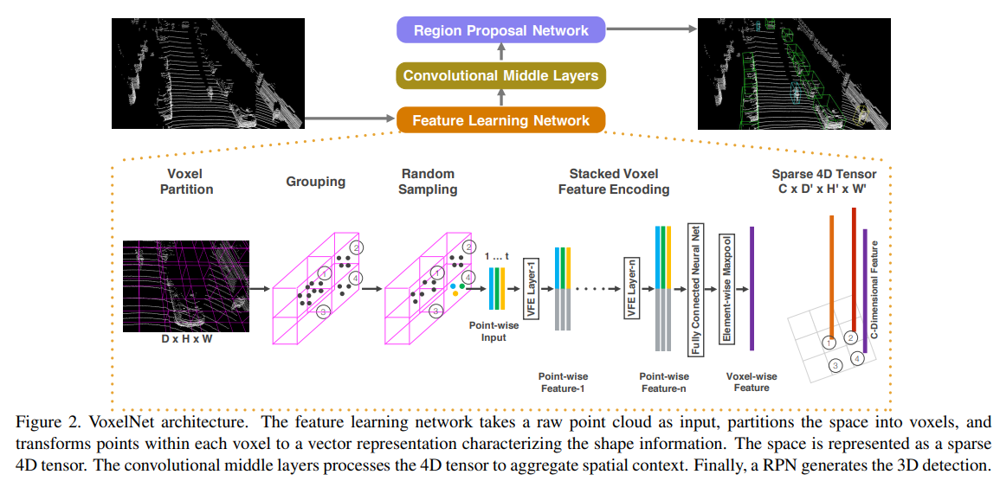
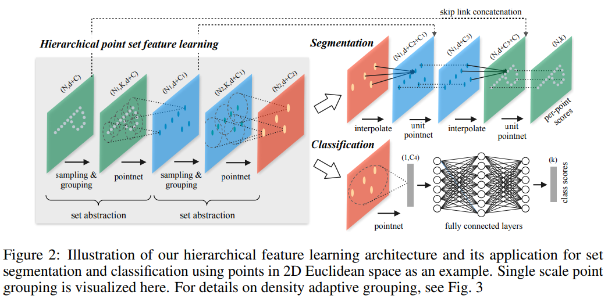
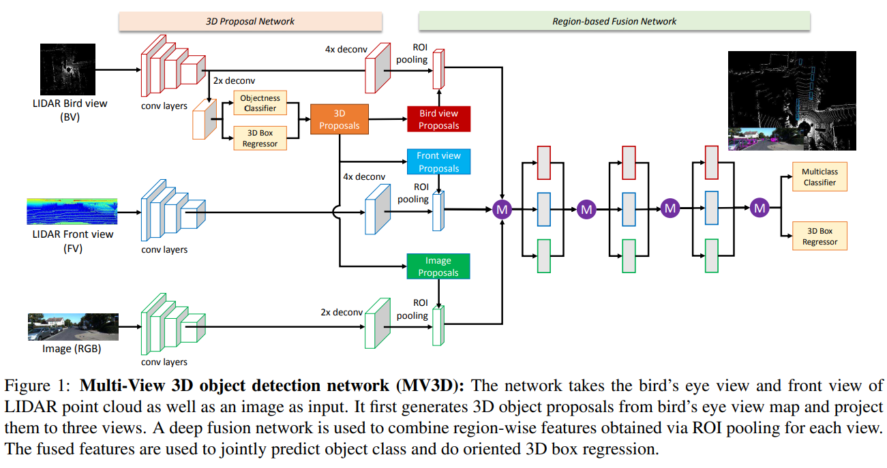
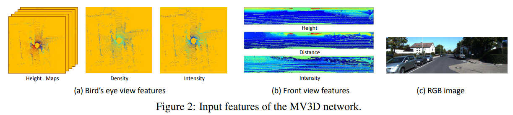
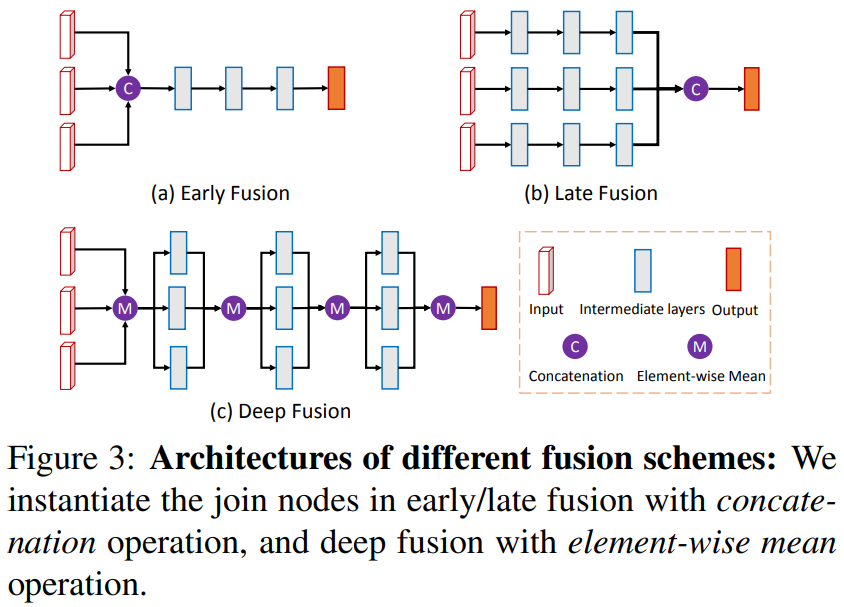
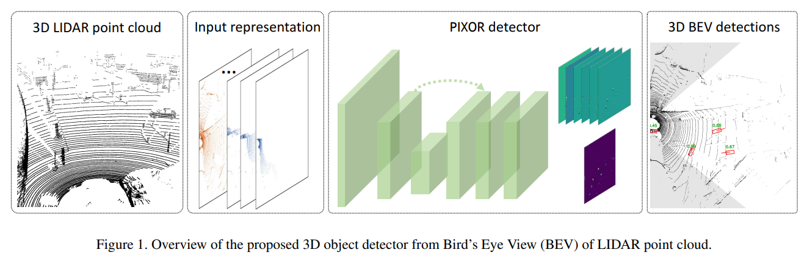
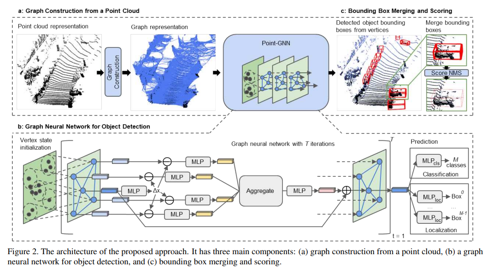
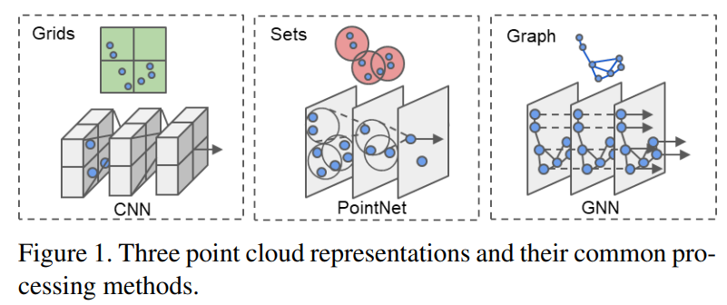

# 3D目标检测
## 3D目标检测方法

* 按传感器类型分 

> 单模态 PointNet/PointNet++/VoxelNet SECOND/PIXOR PointPillars/STD PointRCNN/PointGNN 
>
> ---
>多模态 MV3D UberATG-MMF EPNet

* 按特征提取方法分 
> Point Clouds-基于原始点进行特征提取 
> Voxel-把点云划分成一个个的网格，然后提取网格的特征 
> Graph-利用图的方式，对半径R内的点建立5图，然后提取特征 
> 2D view-把3D投影到2D平面，大部分采用BEV视角，然后用2D卷积提取特征 

1. VoxelNet[1](#1)
>
> 对点云进行网格化，得到规则的特征，然后进行3D卷积。 

2. PointNet++[2](#2)
> 
> 采样算法是最远点采样（farthest point sampling, FPS），相对于随机采样，这种采样算法能够更好地覆盖整个采样空间。点云数据中的一个点的局部由其周围给定半径的球形空间内的其他点构成。 

3. MV3D[3](#3)
> 
> 
> 其中BEV视角对高度进行切片，切片数量为M，加上密度图和强度图，总共生成M+2个特征图。 
> FV视角把雷达投影到圆柱体之后再展开到2维平面 
> 
> 采用的方式为Deep Fusion 

4. PIXOR[4](#4)
> 
> PIXOR和MV3D都是采用把3D视图投影到2D视图的方法，而PIXOR只采用了BEV视角的特征，效果却比MV3D还要好，所以证明BEV视角非常关键。 

5. PointPillar[5](#5)
> 
> 新的点云编码方式，是对SECOND方法的改进。 

6. PointGNN[6](#6)
> 
> 新的3D点云特征的表达方式，缺点是速度慢643ms（Xeon E5-1630 CPU and GTX 1070 GPU），并且雷达线数下降的时候，精度下降很明显。 
> 

* Conclusion
> **特征提取：** 不管是根据Voxel，Point Cloud还是投影到BEV，到底如何更好的表示3维特征是后面关注的重点。 
> **融合方式：** 如何融合数据，前融合、后融合还是深度融合 
> **3D Proposal：** 目前效果比较好的方法普遍是two-stage检测，如何提取有效的提取推荐区域非常关键（一是减少计算量，二是提高精度） 
> **Encoder-Decoder：** 最新的方法普遍采用了生成方法来提高分辨率 
> **语义信息：** 续是否加入语义信息来帮助理解，比如汽车轮子、环境信息等 

* 参考文献 

[1] Y. Zhou, O. Tuzel. VoxelNet: End-to-End Learning for Point Cloud Based 3D Object Detection[C]. Conference on Computer Vision and Pattern Recognition, Salt Lake City, 2018, 4490-4499. 

[2] C. R. Qi, L. Yi, H. Su, et al. PointNet++: Deep Hierarchical Feature Learning on Point Sets in a Metric Space[C]. Advances in Neural Information Processing Systems, Long Beach, 2017, 5099-5108. 

[3] X. Chen, H. Ma, J. Wan, et al. Multi-view 3D Object Detection Network for Autonomous Driving[C]. Conference on Computer Vision and Pattern Recognition, Honolulu, 2017, 6526-6534. 

[4] B. Yang, W. Luo, R. Urtasun. PIXOR: Real-time 3D Object Detection from Point Clouds[C]. Conference on Computer Vision and Pattern Recognition, Salt Lake City, 2018, 7652-7660. 

[5] A. H. Lang, S. Vora, H. Caesar, et al. PointPillars: Fast Encoders for Object Detection From Point Clouds[C]. Conference on Computer Vision and Pattern Recognition, Long Beach, 2019, 12689-12697. 

[6] W. Shi and R. Rajkumar. Point-GNN: Graph Neural Network for 3D Object Detection in a Point Cloud[C]. Conference on Computer Vision and Pattern Recognition, Seattle, 2020, 1708-1716. 